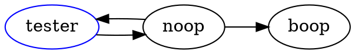

# doc2dot
Generates dot (graphviz) document from code documentation comments like JSDoc, JavaDoc, PHPDoc

```bash
yarn global add dot2doc
# or
npm -g i dot2doc
```

```bash
dot2doc './test/**/*.js'
dot2doc './test/**/*.js' > file.dot
```

```javascript
/**
 * @name abc
 * @param a
 * @param b
 * @dot tester -> noop
 * @dot {ClassA} tester
 * @dot-type ClassA [color=blue]
 */
function tester(a, b) {

}

/**
 * @dot {RelationB} noop -> tester 
 * @dot-type RelationB [shape=arrow]
 */

 // @dot noop -> boop
```



## Licence

MIT
