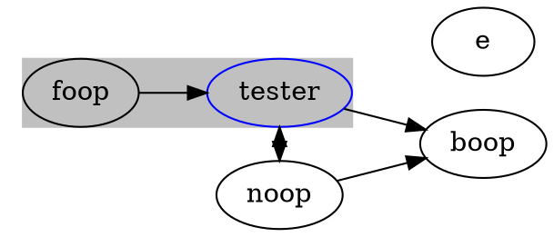

# doc2dot
Generates dot (graphviz) document from code documentation comments like JSDoc, JavaDoc, PHPDoc

```bash
yarn global add dot2doc
# or
npm -g i dot2doc
```

```bash
dot2doc './test/**/*.js'
dot2doc './test/**/*.js' > file.dot
```

## Usage

### Raw DOT entry
``` 
@dot nodeA -> nodeB
```

### DOT node type

```
@dot-type MyNode [color=red]
@dot {MyNode} nodeA
```

will result with

```
nodeA [color=red]
```

### All of type rule

```
@dot-type MyNode [color=red]
@dot {MyNode} nodeA
@dot-rule MyNode -> foo
```

will result with

```
nodeA [color=red]
nodeA -> foo
```

## Define cluster

```
@dot-subgraph Name style=whatever;color=other
@dot-rule foo in A
@dot-rule {Any} in A
@dot {Any} B
```

will result in 

```
subgraph clusterName { style=whatever;color=other A B }
```

## Example

```javascript
/**
 * @name abc
 * @param a
 * @param b
 * @dot tester -> noop
 * @dot {ClassA} tester
 * @dot-type ClassA [color=blue]
 */
function tester(a, b) {

}

/**
 * @dot {RelationB} noop -> tester 
 * @dot-type RelationB [shape=arrow]
 */

 // @dot noop -> boop

 /**
  * @dot-rule ClassA <- foop
  * @dot-rule ClassA -> boop
  * @dot-rule ClassA eachIn A
  * @dot-rule foop in A
  * @dot-subgraph A style=filled;color=gray;
  */


```



## Licence

MIT
